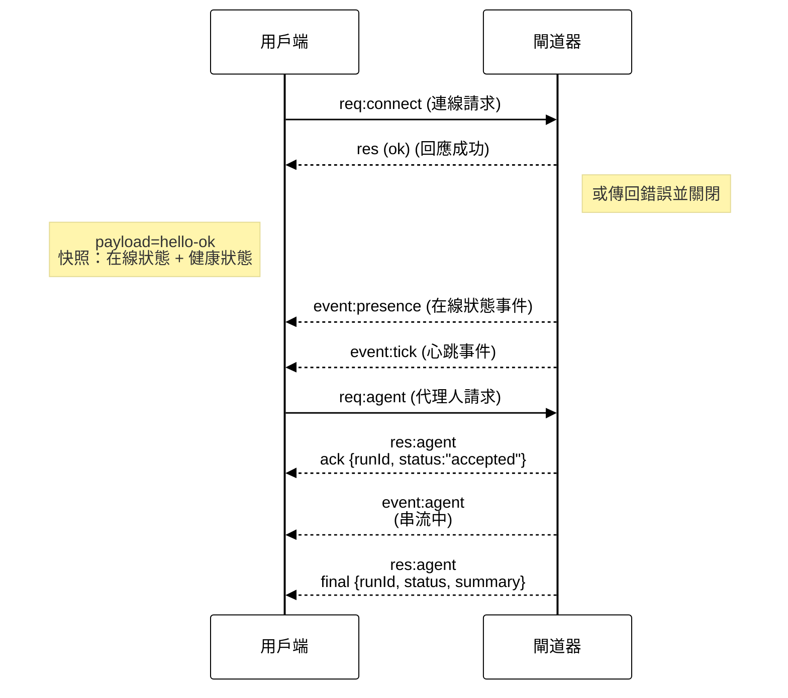

> 此文件為 [English Version](/concepts/architecture_zh_TW) 的繁體中文版本。

# 閘道器架構

最後更新日期：2026-01-22

## 概觀

- 單一長期執行的 **閘道器 (Gateway)** 擁有所有訊息介面（透過 Baileys 的 WhatsApp、透過 grammY 的 Telegram、Slack、Discord、Signal、iMessage、WebChat）。
- 控制平面用戶端（macOS App、CLI、網頁 UI、自動化工具）透過 **WebSocket** 連線至閘道器，連接至組態設定的綁定主機（預設為 `127.0.0.1:18789`）。
- **節點 (Nodes)**（macOS/iOS/Android/無頭模式）同樣透過 **WebSocket** 連線，但會宣告 `role: node` 並具備明確的能力/指令。
- 每個主機僅限一個閘道器；它是唯一開啟 WhatsApp 對談工作階段的地方。
- **Canvas 宿主 (Canvas host)**（預設埠號 `18793`）提供代理人可編輯的 HTML 與 A2UI。

## 組件與流程

### 閘道器 (守護行程)

- 維持提供者 (Provider) 連線。
- 公開具備型別定義的 WS API（請求、回應、伺服器推送事件）。
- 根據 JSON Schema 驗證傳入的框架 (frames)。
- 發出事件如 `agent`、`chat`、`presence`、`health`、`heartbeat`、`cron`。

### 用戶端 (Mac App / CLI / 網頁管理介面)

- 每個用戶端一個 WS 連線。
- 傳送請求 (`health`、`status`、`send`、`agent`、`system-presence`)。
- 訂閱事件 (`tick`、`agent`、`presence`、`shutdown`)。

### 節點 (macOS / iOS / Android / 無頭模式)

- 以 `role: node` 連線至 **同一個 WS 伺服器**。
- 在 `connect` 時提供裝置識別 (device identity)；配對是 **基於裝置** 的（角色為 `node`），且核准資訊儲存在裝置配對存儲區中。
- 公開 `canvas.*`、`camera.*`、`screen.record`、`location.get` 等指令。

通訊協定細節：

- [閘道器通訊協定](/gateway/protocol_zh_TW)

### WebChat

- 靜態 UI，使用閘道器 WS API 獲取聊天歷史紀錄並傳送訊息。
- 在遠端設定中，透過與其他用戶端相同的 SSH/Tailscale 隧道進行連線。

## 連線生命週期 (單一用戶端)



## 有線通訊協定 (Wire protocol) 摘要

- 傳輸方式：WebSocket，使用 JSON 負載的文字框架 (frames)。
- 第一個框架 **必須** 是 `connect`。
- 交握 (Handshake) 之後：
  - 請求 (Requests)：`{type:"req", id, method, params}` → `{type:"res", id, ok, payload|error}`
  - 事件 (Events)：`{type:"event", event, payload, seq?, stateVersion?}`
- 如果設定了 `OPENCLAW_GATEWAY_TOKEN` (或 `--token`)，`connect.params.auth.token` 必須相符，否則通訊端 (socket) 會關閉。
- 具備副作用的方法 (`send`、`agent`) 需要 **冪等性金鑰 (idempotency keys)** 以確保安全重試；伺服器會保留短期的重複刪除快取。
- 節點必須在 `connect` 中包含 `role: "node"` 以及能力/指令/權限。

## 配對 + 本地信任

- 所有 WS 用戶端（操作員 + 節點）在 `connect` 時皆包含 **裝置識別**。
- 新的裝置 ID 需要配對核准；閘道器會為後續連線發放 **裝置 Token**。
- **本地 (Local)** 連線（迴路位址或閘道器主機本身的 tailnet 位址）可以自動核准，以保持同主機的使用者體驗順暢。
- **非本地** 連線必須簽署 `connect.challenge` 隨機隨機數 (nonce) 並需要明確核准。
- 閘道器驗證 (`gateway.auth.*`) 仍適用於 **所有** 連線，不論是本地或遠端。

詳細資訊：[閘道器通訊協定](/gateway/protocol_zh_TW)、[配對](/channels/pairing_zh_TW)、[安全性](/gateway/security_zh_TW)。

## 通訊協定型別與程式碼產生

- TypeBox 架構 (Schemas) 定義了通訊協定。
- JSON Schema 根據這些架構產生。
- Swift 模型根據 JSON Schema 產生。

## 遠端存取

- 偏好方式：Tailscale 或 VPN。
- 替代方式：SSH 隧道

  ```bash
  ssh -N -L 18789:127.0.0.1:18789 user@host
  ```

- 同樣的交握與驗證 Token 適用於此隧道。
- 在遠端設定中，可為 WS 啟用 TLS + 選用的憑證固定 (pinning)。

## 維運快照

- 啟動：`openclaw gateway`（在前台執行，日誌輸出至 stdout）。
- 健康度：透過 WS 進行 `health` 檢查（也包含在 `hello-ok` 中）。
- 監控：使用 launchd/systemd 進行自動重啟。

## 不變量 (Invariants)

- 每個主機恰好有一個閘道器控制單一 Baileys 工作階段。
- 交握是強制性的；任何非 JSON 或非 `connect` 的首個框架都會導致強制斷線。
- 事件不會重放 (replayed)；用戶端必須在出現間隔時重新整理。
