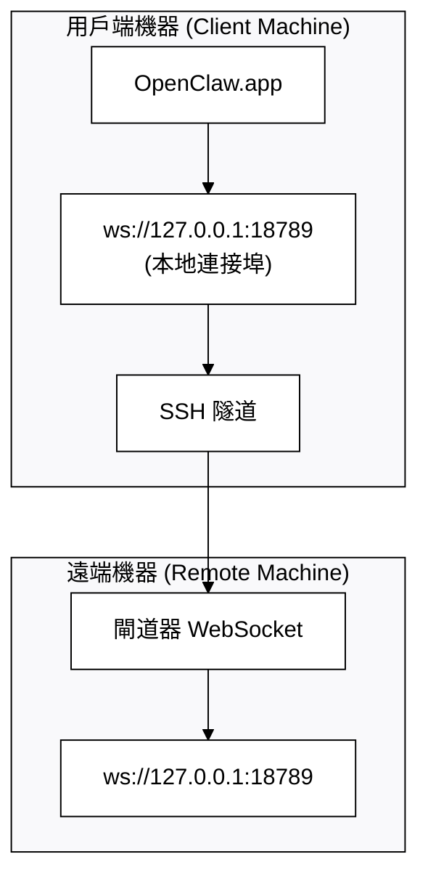

> 此文件為 [English Version](/gateway/remote-gateway-readme) 的繁體中文版本。

# 使用遠端閘道器執行 OpenClaw.app

OpenClaw.app 使用 SSH 隧道 (SSH tunneling) 技術連線至遠端閘道器。本指南將引導您完成相關設定。

## 概觀



## 快速設定

### 步驟 1：新增 SSH 組態

編輯 `~/.ssh/config` 並加入以下內容：

```ssh
Host remote-gateway
    HostName <遠端_IP>          # 例如：172.27.187.184
    User <遠端使用者名稱>            # 例如：jefferson
    LocalForward 18789 127.0.0.1:18789
    IdentityFile ~/.ssh/id_rsa
```

請將 `<遠端_IP>` 與 `<遠端使用者名稱>` 替換為您的實際數值。

### 步驟 2：複製 SSH 密鑰

將您的公鑰複製到遠端機器（需輸入一次密碼）：

```bash
ssh-copy-id -i ~/.ssh/id_rsa <遠端使用者名稱>@<遠端_IP>
```

### 步驟 3：設定閘道器 Token

```bash
launchctl setenv OPENCLAW_GATEWAY_TOKEN "<您的-token>"
```

### 步驟 4：啟動 SSH 隧道

```bash
ssh -N remote-gateway &
```

### 步驟 5：重啟 OpenClaw.app

```bash
# 結束 OpenClaw.app (⌘Q)，然後重新開啟：
open /path/to/OpenClaw.app
```

應用程式現在將透過 SSH 隧道連線至遠端閘道器。

---

## 登入時自動啟動隧道

若要讓 SSH 隧道在您登入時自動啟動，請建立一個啟動代理程式 (Launch Agent)。

### 建立 PLIST 檔案

將以下內容儲存為 `~/Library/LaunchAgents/bot.molt.ssh-tunnel.plist`：

```xml
<?xml version="1.0" encoding="UTF-8"?>
<!DOCTYPE plist PUBLIC "-//Apple//DTD PLIST 1.0//EN" "http://www.apple.com/DTDs/PropertyList-1.0.dtd">
<plist version="1.0">
<dict>
    <key>Label</key>
    <string>bot.molt.ssh-tunnel</string>
    <key>ProgramArguments</key>
    <array>
        <string>/usr/bin/ssh</string>
        <string>-N</string>
        <string>remote-gateway</string>
    </array>
    <key>KeepAlive</key>
    <true/>
    <key>RunAtLoad</key>
    <true/>
</dict>
</plist>
```

### 載入啟動代理程式

```bash
launchctl bootstrap gui/$UID ~/Library/LaunchAgents/bot.molt.ssh-tunnel.plist
```

隧道現在將會：

- 在您登入時自動啟動
- 若崩潰則自動重啟
- 持續在背景執行

舊版註記：若存在任何殘留的 `com.openclaw.ssh-tunnel` LaunchAgent，請將其移除。

---

## 故障排除

**檢查隧道是否正在執行：**

```bash
ps aux | grep "ssh -N remote-gateway" | grep -v grep
lsof -i :18789
```

**重啟隧道：**

```bash
launchctl kickstart -k gui/$UID/bot.molt.ssh-tunnel
```

**停止隧道：**

```bash
launchctl bootout gui/$UID/bot.molt.ssh-tunnel
```

---

## 運作原理

| 組件 | 功能說明 |
| ------------------------------------ | ------------------------------------------------------------ |
| `LocalForward 18789 127.0.0.1:18789` | 將本地連接埠 18789 轉發至遠端連接埠 18789 |
| `ssh -N` | 建立 SSH 連線但不執行遠端指令（僅進行連接埠轉發） |
| `KeepAlive` | 若隧道崩潰則自動重啟 |
| `RunAtLoad` | 當代理程式載入時立即啟動隧道 |

OpenClaw.app 連線至您用戶端機器上的 `ws://127.0.0.1:18789`。SSH 隧道會將該連線轉發至遠端機器（即閘道器執行處）的 18789 連接埠。
