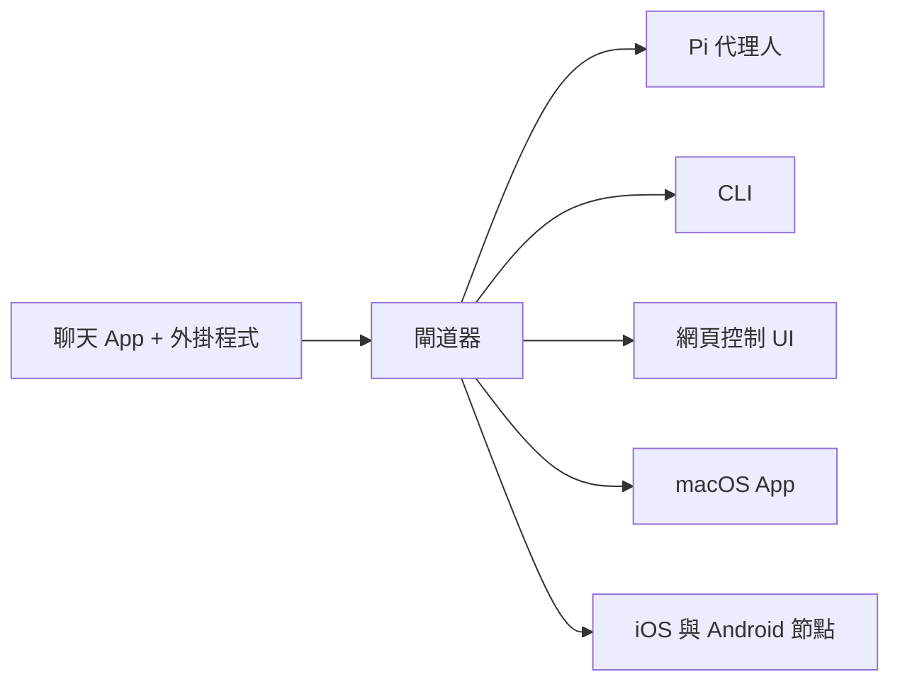

> 此文件為 [English Version](/index) 的繁體中文版本。

# OpenClaw 🦞

<p align="center">
    
    
</p>

> _"EXFOLIATE! EXFOLIATE!"_ — 可能是一隻太空龍蝦說的

<p align="center">
  <strong>支援任何作業系統的閘道器，連通 WhatsApp、Telegram、Discord、iMessage 等平台的 AI 代理人。</strong><br />
  只需傳送訊息，即可從口袋中獲得代理人的回覆。外掛程式還支援 Mattermost 等更多平台。
</p>

<Columns>
  <Card title="新手入門" href="/start/getting-started_zh_TW" icon="rocket">
    在幾分鐘內安裝 OpenClaw 並啟動閘道器。
  </Card>
  <Card title="執行設定精靈" href="/start/wizard_zh_TW" icon="sparkles">
    透過 `openclaw onboard` 與配對流程進行引導式設定。
  </Card>
  <Card title="開啟控制 UI" href="/web/control-ui_zh_TW" icon="layout-dashboard">
    啟動瀏覽器儀表板進行聊天、組態設定與會話管理。
  </Card>
</Columns>

## 什麼是 OpenClaw？

OpenClaw 是一款 **自代管閘道器 (self-hosted gateway)**，能將您喜愛的聊天應用程式（WhatsApp、Telegram、Discord、iMessage 等）連接到 Pi 等 AI 編碼代理人。您只需在自己的機器（或伺服器）上執行單個閘道器程序，它就會成為通訊軟體與隨時待命的 AI 助理之間的橋樑。

**這適合誰？** 適合希望擁有一個可以隨時隨地發送訊息，且無需放棄數據控制權或依賴代管服務的開發者與進階使用者。

**有什麼獨特之處？**

- **自代管**：在您的硬體上執行，遵循您的規則。
- **多頻道**：單個閘道器可同時為 WhatsApp、Telegram、Discord 等提供服務。
- **代理人原生**：專為編碼代理人打造，具備工具調用、會話管理、記憶與多代理人路由功能。
- **開源**：採用 MIT 授權，由社群驅動。

**需要準備什麼？** Node 22+、API 密鑰（建議使用 Anthropic）以及 5 分鐘的時間。

## 運作原理



閘道器是會話、路由與頻道連線的單一事實來源。

## 關鍵能力

<Columns>
  <Card title="多頻道閘道器" icon="network">
    透過單個閘道器程序支援 WhatsApp、Telegram、Discord 和 iMessage。
  </Card>
  <Card title="外掛頻道" icon="plug">
    透過擴充套件加入 Mattermost 等更多平台。
  </Card>
  <Card title="多代理人路由" icon="route">
    為每個代理人、工作區或傳送者提供隔離的會話。
  </Card>
  <Card title="媒體支援" icon="image">
    傳送與接收影像、音訊及文件。
  </Card>
  <Card title="網頁控制 UI" icon="monitor">
    用於聊天、組態、會話與節點管理的瀏覽器儀表板。
  </Card>
  <Card title="行動端節點" icon="smartphone">
    配對支援 Canvas 的 iOS 與 Android 節點。
  </Card>
</Columns>

## 快速上手

<Steps>
  <Step title="安裝 OpenClaw">
    ```bash
    npm install -g openclaw@latest
    ```
  </Step>
  <Step title="引導設定並安裝服務">
    ```bash
    openclaw onboard --install-daemon
    ```
  </Step>
  <Step title="配對 WhatsApp 並啟動閘道器">
    ```bash
    openclaw channels login
    openclaw gateway --port 18789
    ```
  </Step>
</Steps>

需要完整的安裝與開發設定說明？請參閱 [快速上手](/start/quickstart_zh_TW)。

## 儀表板

閘道器啟動後，開啟瀏覽器控制 UI。

- 本地預設值：[http://127.0.0.1:18789/](http://127.0.0.1:18789/)
- 遠端存取：[網頁介面](/web_zh_TW) 與 [Tailscale](/gateway/tailscale_zh_TW)

<p align="center">
  
</p>

## 組態設定 (選用)

組態檔案位於 `~/.openclaw/openclaw.json`。

- 如果您 **什麼都不做**，OpenClaw 將以 RPC 模式使用內建的 Pi 二進位檔，並為每個傳送者提供獨立會話。
- 如果您想加強限制，請從 `channels.whatsapp.allowFrom` 以及（針對群組）提及規則開始設定。

範例：

```json5
{
  channels: {
    whatsapp: {
      allowFrom: ["+15555550123"],
      groups: { "*": { requireMention: true } },
    },
  },
  messages: { groupChat: { mentionPatterns: ["@openclaw"] } },
}
```

## 從這裡開始

<Columns>
  <Card title="文件中心" href="/start/hubs_zh_TW" icon="book-open">
    所有文件與指南，依使用案例分類。
  </Card>
  <Card title="組態設定" href="/gateway/configuration_zh_TW" icon="settings">
    核心閘道器設定、Token 及提供者組態。
  </Card>
  <Card title="遠端存取" href="/gateway/remote_zh_TW" icon="globe">
    SSH 與 tailnet 存取模式。
  </Card>
  <Card title="頻道" href="/channels/telegram_zh_TW" icon="message-square">
    WhatsApp、Telegram、Discord 等頻道的專屬設定。
  </Card>
  <Card title="節點" href="/nodes_zh_TW" icon="smartphone">
    具備配對與 Canvas 功能的 iOS 和 Android 節點。
  </Card>
  <Card title="說明" href="/help_zh_TW" icon="life-buoy">
    常見修復與故障排除入口。
  </Card>
</Columns>

## 瞭解更多

<Columns>
  <Card title="完整功能列表" href="/concepts/features_zh_TW" icon="list">
    完整的頻道、路由與媒體能力。
  </Card>
  <Card title="多代理人路由" href="/concepts/multi-agent_zh_TW" icon="route">
    工作區隔離與單一代理人會話。
  </Card>
  <Card title="安全性" href="/gateway/security_zh_TW" icon="shield">
    Token、允許清單與安全控制。
  </Card>
  <Card title="故障排除" href="/gateway/troubleshooting_zh_TW" icon="wrench">
    閘道器診斷與常見錯誤。
  </Card>
  <Card title="關於與銘謝" href="/reference/credits_zh_TW" icon="info">
    專案起源、貢獻者與授權。
  </Card>
</Columns>
